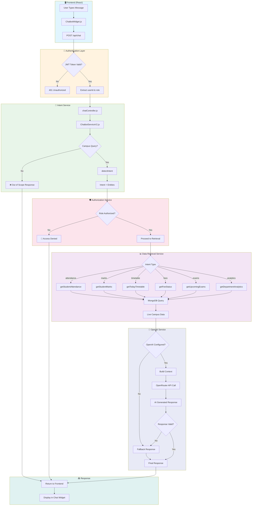
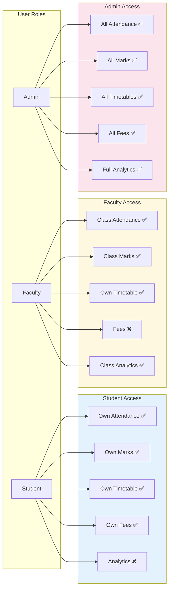
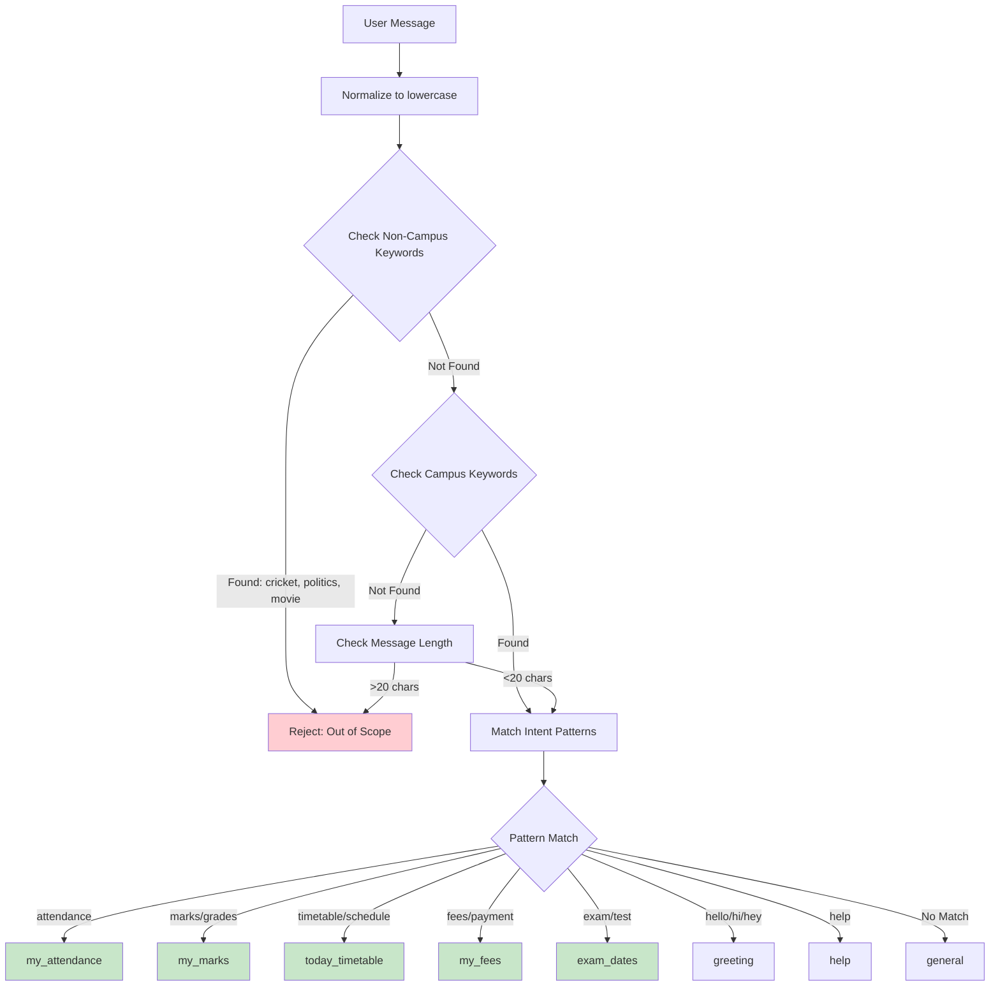

# AI Chatbot Architecture Flowchart

## Complete System Flow



---

## Role-Based Access Flow



---

## Intent Detection Flow



---

## Files Structure

```
backend/
├── services/
│   ├── ChatbotServiceV2.js    ← Main Orchestrator
│   ├── openaiService.js       ← OpenAI/OpenRouter Integration
│   ├── intentService.js       ← Intent Detection
│   ├── authorizationService.js ← Role-Based Access Control
│   └── retrievalService.js    ← MongoDB Data Retrieval
├── controllers/
│   └── chatController.js      ← API Handler
└── routes/
    └── chatRoutes.js          ← POST /api/chat
```
