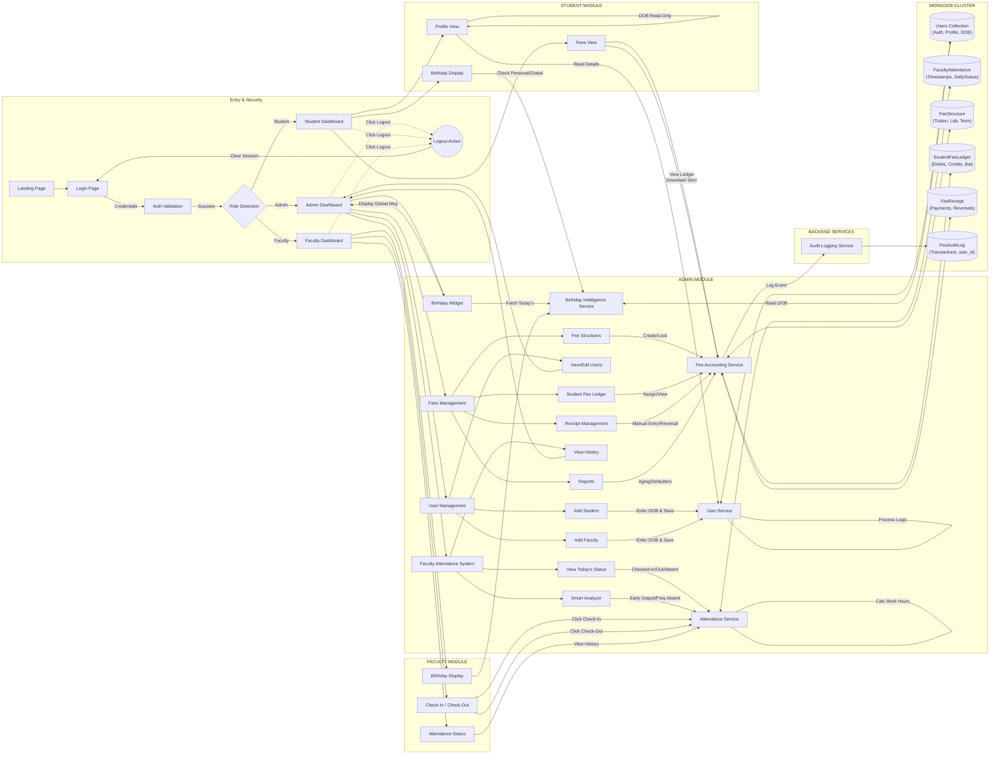

# Smart Campus Management System - End-to-End Flow Validation

## System Description
The **Smart Campus Management System** is a role-based ERP solution designed for university administration. It features a strict segregation of duties between **Admin**, **Faculty**, and **Student** roles. The system manages user lifecycles, faculty attendance tracking with smart analytics, and a comprehensive non-payment fee accounting ledger. It relies on a microservice-like backend architecture communicating with a MongoDB cluster.

## System Flow Diagram

